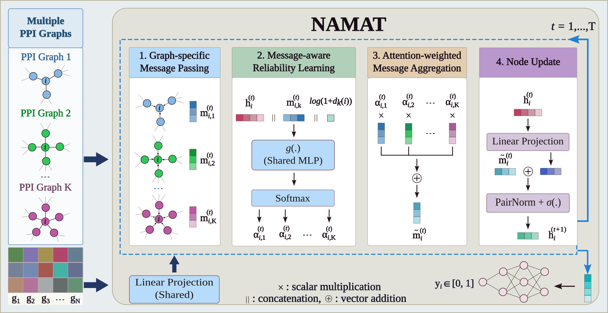

# NAMAT: Node-wise Message-Aware Multi-Graph Attention for Cancer Driver Gene Prioritization

NAMAT is a graph neural network for cancer driver gene prioritization that integrates multiple protein-protein interaction (PPI) networks by estimating graph reliability separately for each gene, instead of applying a single fixed weighting scheme across all genes and networks.

## Model Framework



1. **Graph-specific Message Passing** – node representations are propagated independently across each of the six PPI networks, producing a separate message per network for every gene.
2. **Message-aware Reliability Learning** – a shared MLP scores each (gene, network) pair from the gene's current embedding, that network's propagated message, and the gene's log-degree in that network; a temperature-scaled softmax turns the scores into per-network attention weights.
3. **Attention-weighted Message Aggregation** – the per-network messages are combined into a single update using the learned attention weights.
4. **Node Update** – the aggregated message is linearly projected, added to the previous representation through a residual connection, normalized with PairNorm, and passed through a nonlinearity to produce the next-layer node representation.

## Requirements

- Python 3.9+
- torch >= 2.0
- numpy >= 1.23
- pandas >= 1.5
- scikit-learn >= 1.1

Install with:

```bash
git clone https://github.com/anonymous-namat/NAMAT.git
cd NAMAT
pip install -r requirements.txt
```

A CUDA-capable GPU is recommended; training also runs on CPU, just considerably slower.

## Data

All required data files are included in the `Data/` folder of this repository, so no manual download is needed; just clone the repository and run.

- `PPI/{NAME}_PPI.csv`: six PPI network edge lists (`u, v, weight`) — CPDB, STRING, MultiNet, PCNet, IRefIndex, IRefIndex 2015.
- `node_features/multiomics_features_<CANCER>.csv`: cancer-specific multi-omics node feature matrix (mutation frequency, DNA methylation, gene expression, copy-number alteration).
- `labels/<CANCER>true.txt`: driver gene (positive) labels for each cancer type, one gene symbol per line.
- `labels/2187false.txt`: shared passenger-gene (negative) set, 2,187 genes, used across all cancer types.

`<CANCER>` must match one of: `BRCA, BLCA, LUAD, LIHC, THCA, LUSC, ESCA, PRAD, STAD, COAD, UCEC, CESC`.

## Repository Structure

```
NAMAT/
├── README.md
├── requirements.txt
├── model.py       # NAMAT architecture (PairNorm, message-aware attention, NAMAT module)
├── utils.py        # data loading, graph construction, splitting, metrics
├── run_model.py     # main entry point (CLI, training / evaluation loop)
└── Data/
    ├── PPI/               # six PPI network edge lists
    ├── labels/            # driver / passenger gene labels
    └── node_features/     # multi-omics node features, one CSV per cancer type
```

## Usage

```bash
# Run NAMAT for BRCA with default settings (10 runs x 5-fold cross-validation)
python run_model.py --root ./Data --outdir ./outputs --cancer BRCA

# Run for LUAD with fewer runs/epochs, e.g. for a quick sanity check
python run_model.py --root ./Data --outdir ./outputs --cancer LUAD --n_runs 1 --max_epochs 30 --patience 15
```

`--max_epochs 30 --patience 15` caps training to 30 epochs and stops early if validation loss doesn't improve for 15 epochs — to quickly check the pipeline. Omit these two flags to reproduce the AUPRC values reported in the paper.

The script will:

- Load the six PPI networks and the cancer-specific multi-omics feature matrix from `--root`.
- Build the shared gene universe from the intersection of the omics features and the union of all PPI networks (cached for reuse across runs).
- Run stratified 5-fold cross-validation, repeated over `--n_runs` random seeds, training NAMAT with node-wise message-aware attention over all six PPI networks.
- Print per-fold validation/test AUPRC, a per-run summary, and an overall mean ± std AUPRC across all folds and runs.

Run `python run_model.py --help` for the full list of configurable hyperparameters (learning rate, dropout, attention temperature schedule, PPI dropout, warm-up epochs, etc.).
